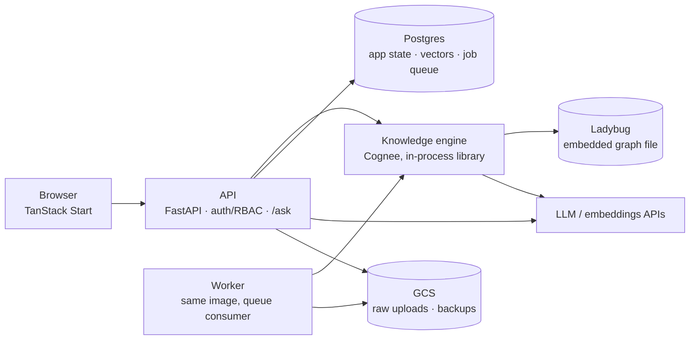

# Architecture

Course knowledge store, Stage 1 (Cognee-backed). Status: go for Phase 1 ([ADR 0006](../adr/0006-cognee-go-for-phase-1.md)). Phase 2's concept graph is unexercised and is the risk that could still trigger the Stage 2 swap.

This is the one-page view: what the system does, its shape, and the decisions that hold it up. Detail lives in the topic pages:

- [components.md](./components.md): what runs, ownership, fallbacks
- [data-model.md](./data-model.md): app tables, Cognee datasets, ontology, provenance
- [flows.md](./flows.md): enrol, ingest, notes, ask, related concepts
- [security.md](./security.md): trust boundaries, isolation, injection defense
- [operations.md](./operations.md): deployment, CI, backups, failure modes
- [backlog.md](./backlog.md): deferred decisions and open backlog issues

Settled decisions with their rationale are ADRs in [`docs/adr/`](../adr/).

## What it does

Students ask questions scoped to a course and get grounded, cited answers drawn from two knowledge tiers: the course's official materials (shared) and their own notes (private). Phase 2 adds related concepts from a per-course concept graph.

## Shape

A three-container monolith (web / api / worker) plus Postgres and Caddy on one GCP VM under docker compose. The API is the only component that knows about users; Cognee never sees a browser request or a token. The Worker is the API image with a different entrypoint, consuming a Postgres-table job queue. The browser-to-API boundary is a generated OpenAPI contract, `contracts/openapi.json` ([ADR 0005](../adr/0005-generated-openapi-contract.md)).

## Stack

TanStack Start (React, TanStack Router + Query, Nitro) · FastAPI (Python 3.14, uv) · Cognee (pinned) · Postgres 16 + pgvector · Ladybug (embedded) · GCS · Caddy · docker compose · GitHub Actions.

## Load-bearing decisions

1. **Two knowledge tiers, one query.** Each course has a global dataset (all enrolled readers) and per-user private datasets (owner only). A single `/ask` spans both: one `search` call, but Cognee fans out per dataset and returns one completion *per tier*, so the fused answer is composed above Cognee ([flows.md](./flows.md) steps 6-8). Isolation is enforced twice: Cognee dataset permissions and an API-level citation check, both exercised by a CI canary test. [ADR 0002](../adr/0002-two-tier-datasets-double-isolation.md)
2. **Cognee in-process, behind a thin API.** No Cognee server is exposed; the library runs inside api and worker with per-call principals. The `/ask` and ingest contracts are engine-agnostic so a Stage 2 swap (pgvector plus own concept graph) changes nothing above the API. [ADR 0001](../adr/0001-cognee-as-knowledge-engine.md)
3. **Everything expensive is async.** Cognify (LLM extraction) runs only in the worker, with retries and cost ceilings. The queue is a Postgres table. No broker, no Redis; it lives inside the same backup. [ADR 0003](../adr/0003-postgres-table-job-queue.md)
4. **Python backend now, Go at the edges.** Stage 1 backend is Python because Cognee is a Python library on the hot query path. Go gets the admin CLI now and, conditionally, a Stage 2 backend rewrite behind contracts that will be frozen as an in-repo OpenAPI spec. [ADR 0004](../adr/0004-python-backend-go-cli.md)
5. **Single-VM ops.** Embedded graph DB (Ladybug, settled at the go/no-go), nightly `pg_dump` plus graph tarball to GCS, compose profiles for fallbacks (Neo4j), pinned versions gated by canary tests. Deliberately not an ADR; see [backlog.md](./backlog.md).

## What this architecture deliberately does not do

- No cross-course queries; a session is always scoped to one course.
- No temporal versioning of materials (a re-upload replaces). Graphiti-style bi-temporal facts are a Stage 3 concern.
- No super-user retrieval path in the API; admin debugging uses a CLI with an explicit principal.
- No Cognee REST server or MCP server exposed; the library runs in-process behind the API. (An MCP server is a Final Project candidate.)
- No separate vector DB; pgvector in the app Postgres is the vector store.
- No message broker; the job queue is a table.
